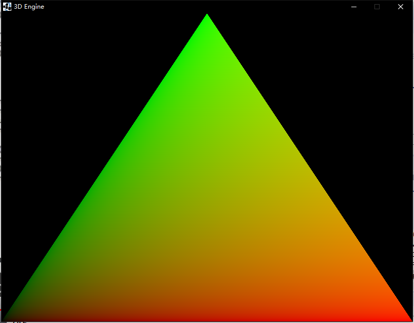

# GameEngine-Java-3D

使用Java实现一个游戏引擎

## 编写一个Vector2f - 2维向量

添加运算 求模 点积 单位化 旋转 向量加减乘除

## 编写一个Vector3f - 3维向量

添加运算 求模 点积 外积（叉积） 单位化 旋转 向量加减乘除

## 编写一个Quaternion - 四元数 简化旋转计算

添加运算 求模  单位化 四元数乘法

## 编写一个Matrix4f - 四维矩阵 

添加运算 单位化 四元数乘法

## 编写Vertex 类

3维点结构

## 编写Mesh 

添加顶点 并 绘制

## 创建资源文件夹res

> * models
> * shaders --着色器
> * textures

### shaders --着色器

fs后缀名的文件类型，通常是指矢量文件格式

## 创建资源加载器

根据文件路径加载文件资源

## 编写 shaders 着色器

为资源着色

