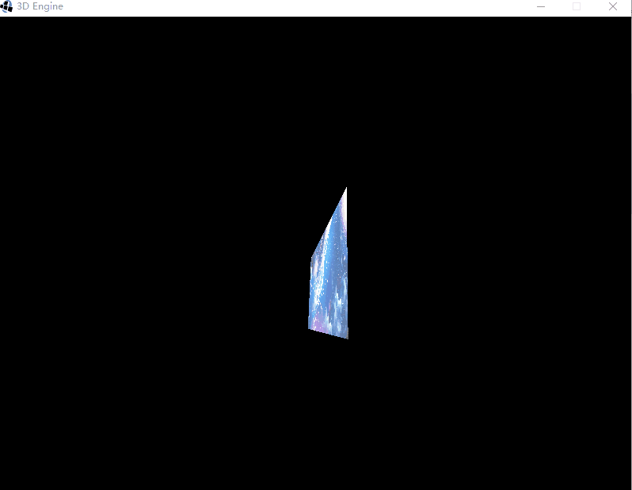

# GameEngine-Java-3D

使用Java实现一个游戏引擎

## 编写一个Vector2f - 2维向量

添加运算 求模 点积 单位化 旋转 向量加减乘除

## 编写一个Vector3f - 3维向量

添加运算 求模 点积 外积（叉积） 单位化 旋转 向量加减乘除

在添加Camera前，要在Vector3f内添加 旋转公式

[三维旋转：欧拉角、四元数、旋转矩阵、轴角之间的转换](https://zhuanlan.zhihu.com/p/45404840)

## 编写一个Quaternion - 四元数 简化旋转计算

添加运算 求模  单位化 四元数乘法

## 编写一个Matrix4f - 四维矩阵 

添加运算 单位化 四元数乘法

添加Transorm前要添加好矩阵平移与旋转运算的初始化

### 平移

### 旋转

### 缩放

### 透视投影

[透视投影公式证明过程](https://www.cnblogs.com/bluebean/p/5276111.html)

### 世界坐标系向摄像机坐标系转化  --->摄像机矩阵

## 编写Vertex 类

3维点结构

## 编写Mesh 

### 添加顶点 并 绘制

### 添加mesh face 使用基于面渲染 而不是点渲染 减少冗余数据

## 创建资源文件夹res

> * models
> * shaders --着色器
> * textures

### shaders --着色器

fs后缀名的文件类型，通常是指矢量文件格式

## 创建资源加载器

### 资源文件类型
> * shaders 着色器文件 vs fs GLSL编写文件
> * model 文件 blender 导出的obj文件  加载到mesh中

其中obj文件里记录了两类信息 v-->顶点坐标信息 f-->mesh face的信息
下图为通过 obj加载器 加载blender导出的方块

根据文件路径加载文件资源

## 编写 shaders 着色器

为资源着色

其中使用了GLSL着色语言写的资源

> GLSL - OpenGL Shading Language 也称作 GLslang，是一个以C语言为基础的高阶着色语言。它是由 OpenGL ARB 所建立，提供开发者对绘图管线更多的直接控制，而无需使用汇编语言或硬件规格语言。
> 已在渲染管线中的顶点（vertex）和片断（fragment）层次中，加入更具弹性的新功能。 达到在这个层次中，使用片断和顶点着色器的可编程性

## 为shaders 添加Uniform方法

动态调整颜色

## 编写Transorm

> * 平移 Translation
> * 旋转 Rotation
> * 缩放 Scale
> * 透视投影 perspective projection
> * 转化到摄像机坐标系 cameraRotation  +  cameraTranslation

### 透视投影

在添加透视投影前，要在矩阵类（Matrix4f）添加投影的计算方法

> 透视投影是为了获得接近真实三维物体的视觉效果而在二维的纸或者画布平面上绘图或者渲染的一种方法，它也称为透视图。透视投影的绘制必须根据已有的几何规则进行。

## 编写Camera

在添加Camera前，要在矩阵类（Matrix4f）添加转化到摄像机坐标系的的计算方法

## 编写Texture 与 Material

用来给模型上材质

## 添加光源

> * 环境光 ambient light

### 环境光 ambient light

下图为将环境光亮值设置为0.1 Vector3f(0.1f,0.1f,0.1f)); 让周围环境变暗

下图为将环境光亮值设置为10 Vector3f(10f,10f,10f)); 让周围环境变亮

